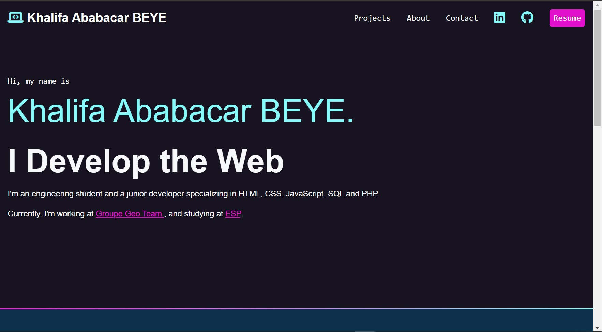

# My Portfolio

My portfolio site is a showcase of my skills, experience, and projects as a junior software developer. As a recent graduate with a degree in Computer Science, I have gained hands-on experience working on a variety of projects and technologiesin web development. I have a passion for coding and solving problems, and my portfolio site reflects my dedication to the craft.
My target audience is potential employers, recruiters, and fellow developers who are interested in my work and skills. By showcasing my projects and skills on my portfolio site, I hope to demonstrate my proficiency and commitment to software development and attract job opportunities that align with my career goals.

# Table of Contents
[About Me](index.html#about).
[Projects](index.html#projects).
[Skills](index.html#skills).
[Contact Me](index.html#contact).

# About Me
Persevering, autonomous and dynamic, I am an engineering student at the École Supérieure Polytechnique de Dakar. I am rigorous, productive and curious, which gives me an opening to several fields and ready to take on new challenges.

# Projects
## Wordle Masters
### Description 
Wordle Masters is a clone of the popular word guessing game called Wordle. The game challenges players to guess a five-letter word by suggesting words that are then checked for matching letters. The objective of the game is to guess the word with as few attempts as possible.
### Technologies Used: 
JavaScript, HTML, CSS.

# Skills
<u>Programming Languages</u>: Java, JavaScript, C.   
<u>Web Development</u>: HTML, CSS, JavaScript, PHP, Node.js, Express.js.   
<u>Databases</u>: MySQL, MongoDB.   
<u>Tools</u>: Git, GitHub, Visual Studio, Tortoise SVN.   
<u>Other</u>: Agile development, Object-Oriented Programming (OOP).   

# Contact Me
Please feel free to contact me if you have any questions or would like to discuss a project.   
Email: <a href="mailto:khalifaababacarbeye@esp.sn">khalifaababacarbeye@esp.sn</a>.   
LinkedIn: [https://linkedin.com/in/khalifa-ababacar-beye](linkedin.com/in/khalifa-ababacar-beye).   
Twitter: [@oyabun-dev](https://twitter.com/oyabun_dev).    

# License
This project is licensed under the MIT License - see the [LICENSE](https://opensource.org/licenses/MIT) file for details.

# Acknowledgments
I would like to thank the following frameworks, libraries, and resources for their valuable contributions to this project:   
[Font Awesome](https://fontawesome.com/) - Icon library for web applications.   
[Google Fonts](https://fonts.google.com/) - Free and open-source font library.   
[GitHub Pages](https://pages.github.com/) - Hosting service for static websites.   
Without these tools and resources, this project would not have been possible. I am grateful for the efforts of their creators and maintainers, and for their commitment to open-source software development.  